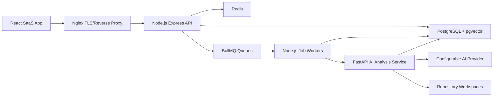

# AI Software Archaeologist: Phase 01 System Architecture

## Phase Status

Status: awaiting architecture review.

This phase defines the production architecture and quality gates for the AI Software Archaeologist platform. Implementation must not begin until this architecture is reviewed and accepted or amended.

## Product Scope

AI Software Archaeologist is a commercial SaaS platform for ingesting software repositories, analyzing source code, building semantic and structural knowledge, generating documentation, detecting engineering risks, and answering codebase questions with repository-aware context.

Primary capabilities:

- Repository intake from GitHub URL, ZIP upload, and local folder upload.
- Automated repository validation, extraction, language detection, technology detection, dependency detection, and architecture detection.
- Static and semantic analysis for dependency graphs, call graphs, class diagrams, sequence diagrams, database diagrams, and REST API diagrams.
- Repository, module, file, function, and business-logic explanations.
- Context-aware AI chat and semantic search.
- Documentation generation for README, API docs, architecture docs, onboarding, deployment, and testing.
- Security, maintainability, complexity, technical debt, duplication, dead code, dependency, and performance analysis.

## Architecture Principles

- Keep user-facing request handling separate from long-running analysis.
- Treat repository content as untrusted input.
- Prefer deterministic static analysis before AI interpretation.
- Persist normalized analysis artifacts before generating summaries or chat answers.
- Make every expensive operation resumable, observable, and idempotent.
- Use explicit tenant and repository boundaries in every data access path.
- Keep provider-specific AI calls behind interfaces so models and vendors can change without rewriting domain logic.
- Avoid synchronous API work for repository cloning, parsing, graph generation, embedding, or documentation generation.

## High-Level Topology



## Runtime Components

### Web App

Path: `apps/web`.

Stack:

- React
- TypeScript
- Vite
- TailwindCSS
- ShadCN UI primitives
- React Query
- React Router
- Framer Motion

Responsibilities:

- Authenticated SaaS shell, repository dashboard, upload flows, analysis status, graph views, documentation views, findings, scores, and AI chat.
- Client-side state orchestration through React Query.
- Route-level lazy loading for large views such as graph explorers and documentation workspaces.
- Accessible keyboard and screen-reader behavior for navigation, dialogs, forms, and data-heavy views.

Non-responsibilities:

- No direct repository parsing.
- No AI provider calls from the browser.
- No trusted authorization decisions.

### API Service

Path: `apps/api`.

Stack:

- Node.js
- Express
- TypeScript
- Prisma
- PostgreSQL
- Redis
- BullMQ

Responsibilities:

- Authentication, authorization, tenant scoping, request validation, rate limiting, CSRF protection where cookie auth is used, audit logging, and secure error handling.
- Repository intake orchestration for GitHub URL, ZIP upload, and folder upload metadata.
- Job creation, job status, repository metadata, findings, diagrams, documentation, search, and chat HTTP APIs.
- Prisma-backed transactional domain writes.
- BullMQ job enqueueing for long-running work.

Non-responsibilities:

- No direct tree-sitter parsing.
- No direct embedding generation.
- No shell command execution on untrusted repository content.

### Node Workers

Path: `apps/worker`.

Stack:

- Node.js
- TypeScript
- BullMQ
- Prisma
- Redis

Responsibilities:

- Clone, unpack, validate, and stage repositories in isolated job workspaces.
- Coordinate analysis jobs with the Python AI service.
- Persist job progress, retry state, and failure reasons.
- Enforce file count, repository size, archive depth, symlink, binary file, and timeout limits.

Non-responsibilities:

- No HTTP request handling.
- No AI answer generation logic.

### Python AI Analysis Service

Path: `services/ai`.

Stack:

- Python 3.12
- FastAPI
- Tree-sitter
- GitPython
- NetworkX
- OpenAI SDK through a provider abstraction
- PostgreSQL access for `pgvector` embeddings

Responsibilities:

- Parse source files into symbols, imports, call relationships, and structural metadata.
- Build repository graphs and derived diagrams.
- Generate embeddings for search chunks.
- Retrieve repository context for chat and explanation workflows.
- Produce AI-assisted summaries, documentation drafts, issue explanations, and refactoring suggestions.

Non-responsibilities:

- No user authentication.
- No tenant authorization decisions beyond validating service-issued job tokens.
- No direct browser-facing API.

### Infrastructure

Path: `infra`.

Components:

- Docker and Docker Compose for local and deployable multi-service runtime.
- Nginx for TLS termination and reverse proxying.
- PostgreSQL with `pgvector` extension.
- Redis for queues, rate limits, and short-lived coordination state.

## Monorepo Layout

```text
apps/
  web/
  api/
  worker/
services/
  ai/
packages/
  config/
  shared/
  ui/
  eslint-config/
  tsconfig/
infra/
  docker/
  nginx/
  postgres/
docs/
  architecture/
  api/
  operations/
  security/
  testing/
scripts/
```

Package responsibilities:

- `packages/shared`: shared TypeScript contracts, constants, error codes, and validation schemas used by web, API, and worker.
- `packages/config`: typed configuration loading helpers for Node services.
- `packages/ui`: design-system wrappers and shared web UI components when reuse justifies extraction.
- `packages/eslint-config`: centralized linting rules.
- `packages/tsconfig`: strict TypeScript base configurations.

## Core Domain Model

Tenant-owned entities:

- `Organization`: tenant boundary.
- `User`: authenticated human account.
- `Membership`: user-to-organization relationship.
- `Role`: organization-scoped role such as owner, admin, analyst, developer, or viewer.
- `Repository`: logical project under analysis.
- `RepositorySource`: source metadata for GitHub, ZIP, or folder upload.
- `RepositorySnapshot`: immutable analyzed state for a repository revision.
- `IngestionJob`: lifecycle state for clone, upload, extraction, and validation.
- `AnalysisRun`: lifecycle state for parsing, graphing, embedding, scoring, documentation, and issue detection.
- `FileNode`: normalized file metadata.
- `Symbol`: functions, classes, interfaces, methods, types, routes, migrations, and schemas discovered in source.
- `DependencyEdge`: import, package, service, database, route, call, inheritance, and ownership relationships.
- `CodeChunk`: search and chat retrieval unit with text range, metadata, hash, and embedding.
- `Diagram`: persisted diagram source plus derived render metadata.
- `Finding`: security, quality, performance, maintainability, dependency, duplication, or dead-code issue.
- `Metric`: versioned score for maintainability, complexity, coverage estimate, security posture, duplication, and debt.
- `Document`: generated documentation artifact with provenance.
- `ChatSession` and `ChatMessage`: repository-aware conversations and retrieved context references.
- `AuditEvent`: security-relevant action trail.

Cross-cutting fields:

- All tenant-scoped records include `organizationId`.
- All repository analysis records include `repositoryId` and usually `snapshotId`.
- Mutable analysis outputs are versioned by `analysisRunId`.
- User-generated and AI-generated artifacts record `createdBy`, `source`, and `provenance`.

## Ingestion Pipeline

1. API validates request shape, authentication, authorization, rate limit, and organization quota.
2. API creates `Repository`, `RepositorySource`, and `IngestionJob` records in a transaction.
3. API enqueues a BullMQ job and returns a job identifier.
4. Worker creates an isolated workspace with a job-scoped path.
5. Worker performs source-specific retrieval:
   - GitHub URL: allowlisted protocol, validated host, bounded clone timeout, bounded depth, and no credential leakage.
   - ZIP upload: bounded size, bounded archive depth, safe extraction, symlink rejection, and path traversal prevention.
   - Folder upload: browser sends a manifest plus files; server enforces path and size limits before staging.
6. Worker validates repository limits, detects languages and package manifests, and stores normalized metadata.
7. Worker creates a `RepositorySnapshot`.
8. Worker enqueues analysis jobs for parsing, dependency detection, graph construction, embeddings, scoring, findings, and documentation.

## Analysis Pipeline

1. Node worker calls the Python AI service using a signed internal job token.
2. Python service scans staged files through allowlisted analyzers.
3. Tree-sitter extracts symbols, syntax ranges, imports, and language-specific relationships.
4. Dependency analyzers parse package manifests with structured parsers.
5. Graph builder creates nodes and edges in NetworkX and emits normalized graph records.
6. Chunker creates deterministic code chunks with stable hashes.
7. Embedding generator stores vectors in Postgres `pgvector`.
8. Detection engines produce findings and metrics.
9. Documentation generator creates versioned documents from normalized artifacts and retrieved context.
10. API exposes analysis results after access checks and snapshot consistency checks.

## AI Retrieval Strategy

Retrieval order:

1. Exact entity references from selected repository, file, symbol, route, or finding.
2. Structural graph neighborhood around relevant files and symbols.
3. Semantic vector search against `CodeChunk`.
4. Recent generated documents for high-level context.
5. Conversation-local context.

Answer requirements:

- Answers cite files, symbols, or documents used as context.
- The AI service separates retrieved context from generated text.
- Provider responses are stored with model metadata, prompt version, token usage, and trace identifiers.
- User-visible answers must not claim analysis beyond available artifacts.

## API Surface

Representative route groups:

- `POST /auth/login`
- `POST /auth/logout`
- `GET /me`
- `GET /organizations/:organizationId/repositories`
- `POST /organizations/:organizationId/repositories/github`
- `POST /organizations/:organizationId/repositories/zip`
- `POST /organizations/:organizationId/repositories/folder`
- `GET /repositories/:repositoryId`
- `GET /repositories/:repositoryId/jobs/:jobId`
- `GET /repositories/:repositoryId/snapshots/:snapshotId/files`
- `GET /repositories/:repositoryId/snapshots/:snapshotId/graph`
- `GET /repositories/:repositoryId/snapshots/:snapshotId/findings`
- `GET /repositories/:repositoryId/snapshots/:snapshotId/metrics`
- `GET /repositories/:repositoryId/snapshots/:snapshotId/documents`
- `POST /repositories/:repositoryId/chat/sessions`
- `POST /repositories/:repositoryId/chat/sessions/:sessionId/messages`

API conventions:

- Request and response schemas are shared through versioned validation contracts.
- Every mutating route emits audit events.
- Every route has per-user and per-organization rate limits.
- Pagination is cursor-based for large result sets.
- Errors use stable machine-readable codes and safe messages.

## Security Architecture

Authentication:

- Start with email/password plus secure session cookies for local-first development.
- Session cookies are `HttpOnly`, `Secure` in production, `SameSite=Lax` or stricter, and rotated on login.
- Passwords are hashed with a memory-hard algorithm.
- API tokens can be added later as scoped machine credentials.

Authorization:

- RBAC is enforced in the API service.
- Roles are organization scoped.
- Repository access requires organization membership and route-specific permissions.
- Internal worker and AI calls use short-lived signed job tokens.

Input and repository safety:

- All HTTP inputs are schema validated.
- Archive extraction rejects absolute paths, parent traversal, symlinks, hard links, special files, nested archive expansion beyond limits, and oversized files.
- GitHub URLs are parsed with URL APIs and restricted to safe protocols.
- Server-side fetches use SSRF protections, host validation, DNS rebinding safeguards where supported, request timeouts, and response size limits.
- Repository content is never executed.
- Shell invocation is avoided for repository analysis; library APIs are preferred.

Data protection:

- Secrets are loaded only from environment variables.
- Sensitive values are redacted from logs.
- Audit events record security-sensitive actions without storing raw secrets.
- Repository files may contain secrets; findings can reference secret locations without exposing full secret values.

OWASP controls:

- SQL injection: Prisma parameterization and no raw SQL without reviewed wrappers.
- XSS: React escaping, sanitized markdown rendering, and content security policy.
- CSRF: CSRF tokens when cookie-authenticated mutating requests are used.
- SSRF: URL allowlisting and network egress controls for clone/fetch flows.
- Command injection: no untrusted shell commands.
- Path traversal: safe extraction and normalized workspace path checks.
- Prototype pollution: schema validation, dependency review, and defensive object handling.
- Auth flaws: secure sessions, rotation, rate limits, and lockout controls.
- Authorization flaws: centralized policy checks and test coverage for negative cases.
- Sensitive leaks: redaction, secure errors, and controlled provenance output.

## Performance Architecture

- Long-running work is asynchronous through BullMQ.
- Job progress is persisted and observable.
- Repository analysis is snapshot-based to avoid recomputing unchanged artifacts.
- File parsing uses content hashes to skip unchanged files in future reanalysis.
- Vector search uses `pgvector` indexes.
- Expensive graph queries are cached by snapshot and graph type.
- Large lists use cursor pagination.
- Frontend routes use lazy loading and virtualized rendering for large file, finding, and graph lists.
- Streaming responses are used for chat where supported.
- API database access is shaped around bounded queries and explicit indexes.

## Observability

Required signals:

- Structured application logs.
- Request IDs propagated through web, API, worker, and AI service.
- Audit logs for security-relevant user and system actions.
- Job lifecycle events with retry and failure metadata.
- Metrics for request latency, queue depth, job duration, embedding latency, AI token usage, and analysis throughput.
- Health endpoints for API, worker, AI service, Postgres, Redis, and Nginx.

## Testing Strategy

Frontend:

- Component tests for forms, dashboards, graph controls, document views, and chat states.
- Accessibility tests for navigation, dialogs, forms, and keyboard flows.
- E2E tests for repository intake, job status, findings, documents, and chat.

API:

- Unit tests for validation, authorization policies, services, and error mapping.
- Integration tests against PostgreSQL and Redis for repository, job, audit, and chat flows.
- Negative tests for unauthorized access, rate limits, invalid inputs, malformed uploads, and cross-tenant access attempts.

Worker:

- Unit tests for safe path handling, archive extraction policy, source validation, and job state transitions.
- Integration tests for retry, idempotency, partial failure, and cleanup.

AI service:

- Unit tests for language analyzers, chunking, graph construction, retrieval, prompt assembly, and provider abstraction.
- Golden tests using small fixture repositories.
- Negative tests for unsupported files, binary files, malformed syntax, large repositories, and missing provider configuration.

Infrastructure:

- Docker Compose smoke tests.
- Production build checks.
- Migration checks.
- Health-check verification.

## Dependency Decisions

- Prisma: typed data access, migrations, and parameterized queries for the Node services.
- PostgreSQL: durable transactional store and reporting-friendly relational model.
- `pgvector`: keeps semantic search close to snapshot, tenant, and authorization metadata.
- Redis: queue coordination, rate limiting, and short-lived state.
- BullMQ: durable background jobs with retries, backoff, and progress reporting.
- FastAPI: clear service boundary for Python analysis and AI workflows.
- Tree-sitter: deterministic multilingual syntax analysis.
- NetworkX: graph construction and graph algorithms in the analysis service.
- GitPython: Git repository operations through a Python library.
- React Query: consistent server-state caching and request lifecycle handling.
- ShadCN: accessible component primitives that can be styled into a polished SaaS interface.

## Phase 01 Architecture Review

Strengths:

- Long-running repository and AI work is isolated from request handling.
- Repository content is modeled as untrusted input.
- Snapshot-based analysis gives reproducibility and makes results auditable.
- `pgvector` avoids operating a separate vector database in the first production architecture.
- Tenant and repository identifiers are explicit in the data model.
- AI output is grounded in persisted analysis artifacts and recorded provenance.

Risks:

- Monorepo complexity can grow quickly across Node and Python tooling.
- Repository upload and extraction are high-risk security surfaces.
- Graph rendering may become slow for large repositories without limits and progressive loading.
- Generated documentation quality depends on reliable retrieval and prompt versioning.
- `pgvector` may need partitioning or a dedicated vector service at higher scale.

Required mitigations:

- Establish strict package boundaries and CI checks before feature work.
- Build upload and safe extraction as one of the first foundation modules.
- Implement graph APIs with pagination, filtering, and size caps from the beginning.
- Store prompt versions, source references, and model metadata for every generated artifact.
- Add explicit organization quotas and repository size limits before public exposure.

## Security Audit

Pass condition for this phase:

- Security-sensitive boundaries have been identified.
- Repository ingestion is asynchronous and isolated.
- Auth, RBAC, audit logging, input validation, rate limiting, safe extraction, SSRF protection, and secure error handling are first-class architecture requirements.

Open security decision for review:

- Confirm whether initial authentication should be email/password sessions only, or include OAuth from the first foundation phase.

## Performance Audit

Pass condition for this phase:

- Expensive operations are off the request path.
- Analysis is snapshot-based.
- Vector search, graph queries, large lists, and chat streaming have defined performance strategies.
- Frontend rendering strategies account for large result sets.

Open performance decision for review:

- Confirm initial repository size limits for local development and first production deployment.

## Maintainability Audit

Pass condition for this phase:

- Service responsibilities are explicit.
- Shared contracts are centralized.
- Provider-specific AI logic is isolated.
- Domain entities are versioned around snapshots and analysis runs.

Open maintainability decision for review:

- Confirm whether generated diagrams should be stored as Mermaid source first, graph JSON first, or both from the first implementation phase.

## Foundation Phase Exit Criteria

The next phase may begin only after architecture review confirms:

- Monorepo structure is accepted.
- Service boundaries are accepted.
- Initial authentication strategy is accepted.
- Initial upload limits are accepted.
- Initial diagram storage strategy is accepted.
- Database ownership and snapshot model are accepted.
- Security controls for repository ingestion are accepted.

